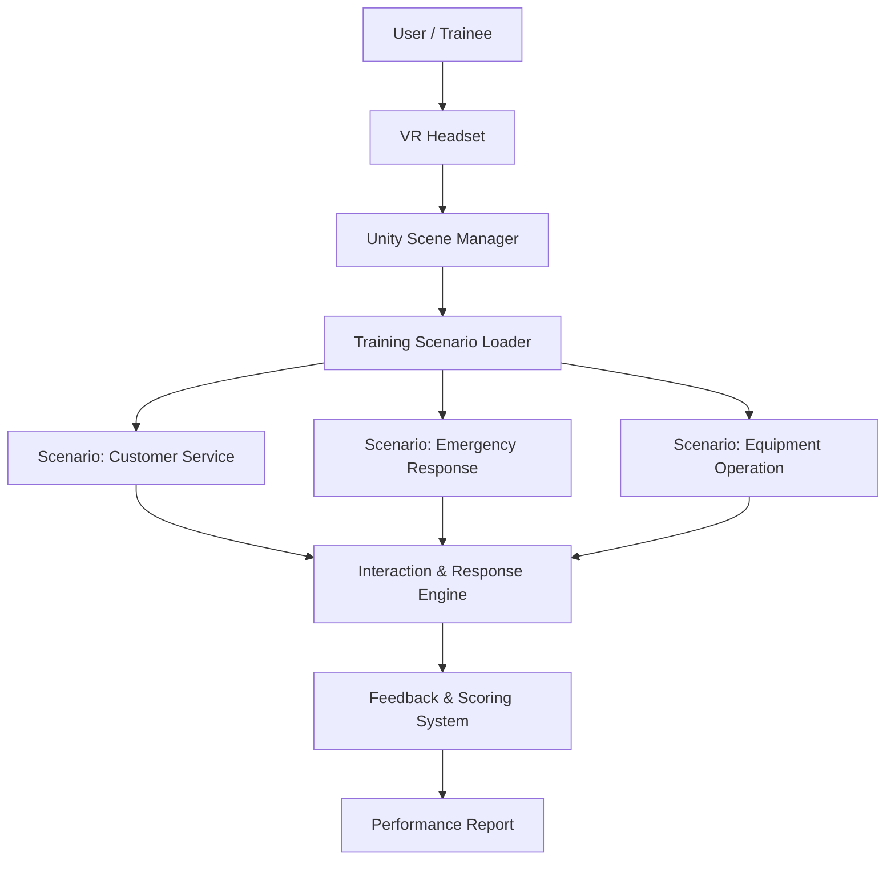

# NDHU IM25 Graduation Project

Built a high-fidelity VR vocational training system with Unity HDRP — bridging the gap where physical training lacks repeatability and web-based training can't handle real conversational scenarios.

## System Architecture

## Highlights

- **Problem**: Physical training limits practice frequency; web-based training fails at conversational and spatial tasks — VR solves both
- **Technical approach**: Unity HDRP rendering pipeline delivers photorealistic training environments with real-time interaction logic in C#
- **Outcome**: Graduation project, NDHU Information Management, Class of 2025

## Repositories

| Repo | Description |
|------|-------------|
| [IM25_HDRP](https://github.com/Love-MrHou/IM25_HDRP) | Main VR training system — Unity HDRP rendering pipeline, core interaction logic |
| [IM25_final](https://github.com/Love-MrHou/IM25_final) | Final release build — optimized scenes and packaged for deployment |

