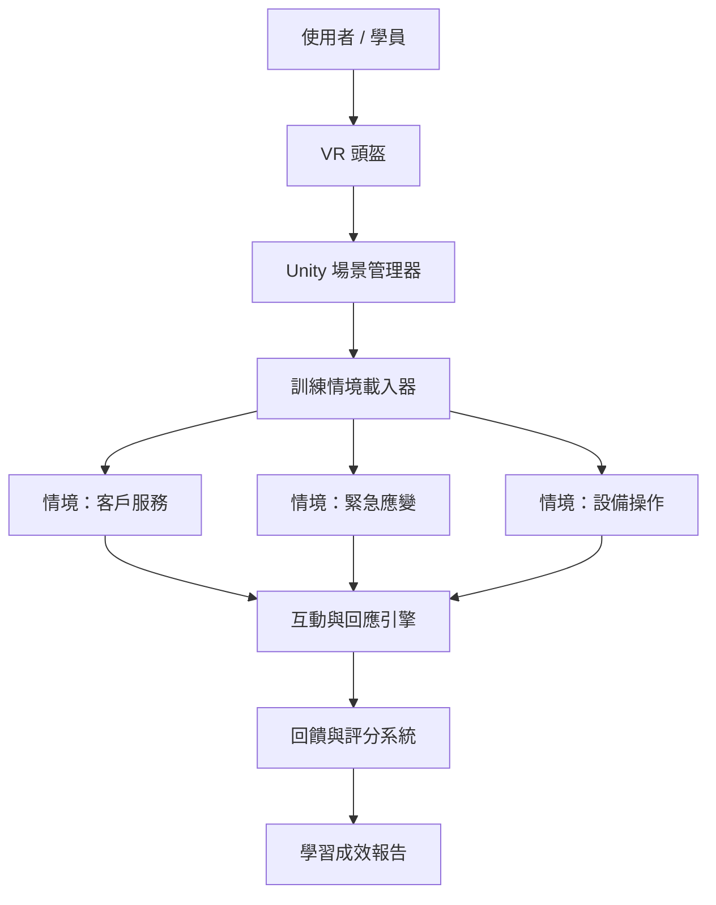

# 國立東華大學 資管 IM25 畢業專題

以 Unity HDRP 建構高擬真度的 VR 職業訓練系統 — 彌補實體訓練無法重複操作、網頁訓練無法處理真實對話情境的缺口。

advised by [Assoc. Prof. Chia-Li Hou](https://im.ndhu.edu.tw/p/405-1050-245626,c22601.php?Lang=zh-tw)

榮獲第二名，畢業專題 — 國立東華大學 資訊管理學系 IM25

## 專題亮點

- **問題**: 實體訓練難以反覆練習；網頁訓練無法應對對話與空間操作任務 — VR 同時解決兩者
- **技術方案**: Unity HDRP 渲染管線打造高擬真訓練場景，以 C# 實作即時互動邏輯
- **成果**: 榮獲第二名，畢業專題 — 國立東華大學 資訊管理學系 IM25

## 程式庫

| Repo | 說明 |
|------|------|
| [IM25_HDRP](https://github.com/Love-MrHou/IM25_HDRP) | 主系統 — Unity HDRP 渲染管線，核心互動邏輯 |

## 系統架構

